<div align="center">
  <a href="https://github.com/minerva-university">
    
  </a>

<h1> </h1>

<h1 align="center" style="color: black; font-family: Arial, sans-serif; font-weight: bold; text-shadow: 1px 1px 2px grey;">SeizureSavvy</h1>

<p align="center">
        <strong>SeizureSavvy</strong> is a comprehensive Progressive Web App designed to enhance the management and prediction of seizure episodes through sophisticated data logging and machine learning technology. It allows users to complete daily surveys where they track seizure episodes they had and log symptoms, including triggers, prodromes and auras, they experienced. It also helps users track their medications. Users receive predictive alerts for episodes to ensure safety and get insights into symptoms correlated with their episodes. The app features an intuitive design for ease of use and strict data privacy measures to protect personal health information. SeizureSavvy combines technology with personal care, making it an essential tool for individuals seeking proactive seizure management. SeizureSavvy is the future of personalized seizure care that every individual with seizures need.
        <br />
        <a href="https://drive.google.com/file/d/13AMgNo9bhJbvzn89ABGNQ3OIdAPkm536/view?usp=sharing"><strong>Learn More About Our Motivation and Research »</strong></a>
        <br />

  </p>

</div>


<!-- TABLE OF CONTENTS -->
<details>
    <summary><strong>Table of Contents</strong></summary>

- [About the Project](#about-the-project)
    - [Features](#features)
    - [User Interface](#user-interface)
    - [Built With](#built-with)
- [Installation](#installation)
    - [Prerequisites](#prerequisites)
    - [Backend Setup](#backend-setup)
    - [Frontend Setup](#frontend-setup)
    - [Verifying the Installation](#verifying-the-installation)
- [Demo](#demo)
- [Our Team](#our-team)
- [Contributions and Issues](#contributions-and-issues)
    - [Contributing to SeizureSavvy](#contributing-to-seizuresavvy)
    - [Reporting Issues](#reporting-issues)
    - [Support](#support)
- [License](#license)

</details>


<!-- ABOUT THE PROJECT -->
## About The Project

### Features
- **Daily Surveys:** Track seizure episodes and log symptoms such as triggers, prodromes, and auras.
- **Medication Tracking:** Keep a detailed log of medication schedules and adherence.
- **Predictive Alerts:** Advanced machine learning algorithms analyze survey data to predict and alert about potential seizure episodes.
- **Symptoms Insights:** Advanced machine learning algorithms analyze survey data to provide users with insights into triggers, prodromes, or auras that are correlated with their episodes.
- **Data Privacy:** Rigorous data protection protocols to secure personal health information.

### User Interface
The SeizureSavvy app features a clean, intuitive, and user-friendly interface designed for easy navigation and accessibility on both mobile and desktop platforms. Below are some screenshots showcasing various aspects of the UI:

<table>
  <tr>
    <td>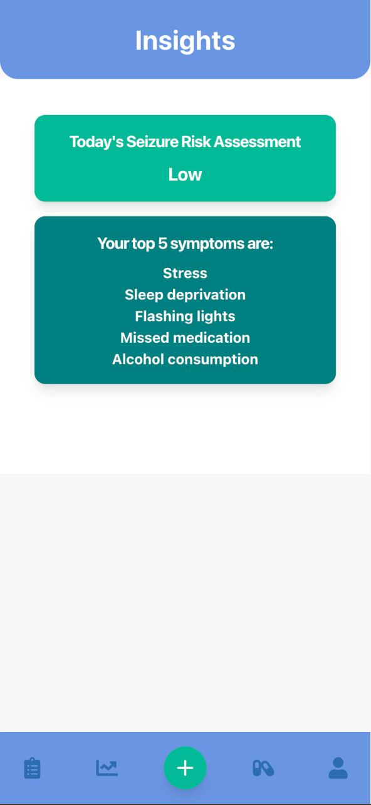<p align="center"></p></td>
    <td>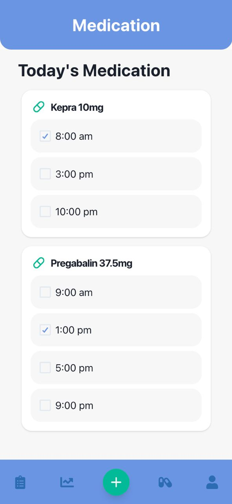<p align="center"></p></td>
    <td>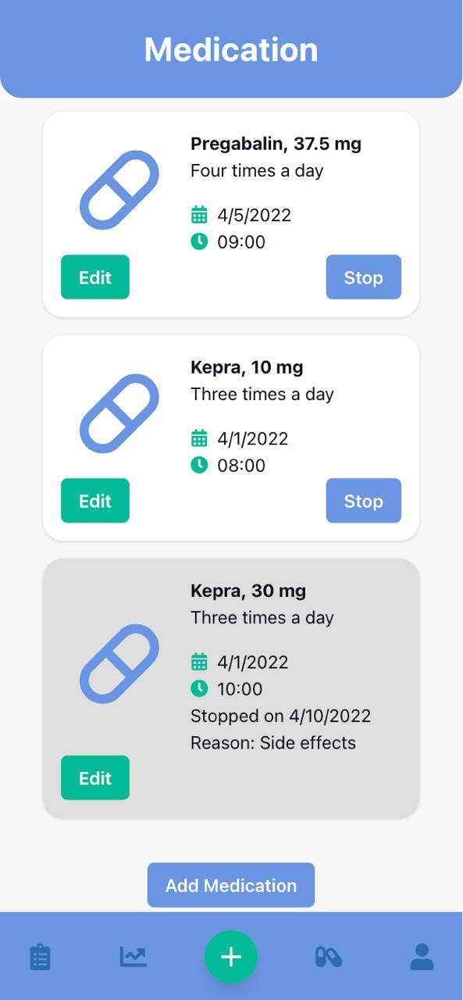<p align="center"></p></td>
    <td>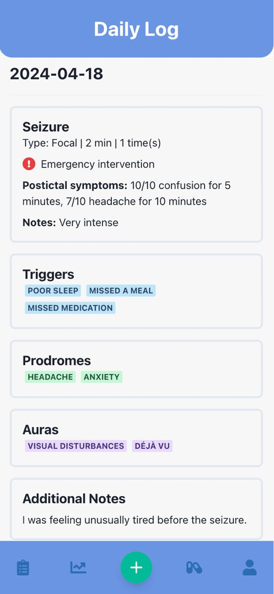<p align="center"></p></td>
  </tr>
  <tr>
    <td><p align="center"></p></td>
    <td>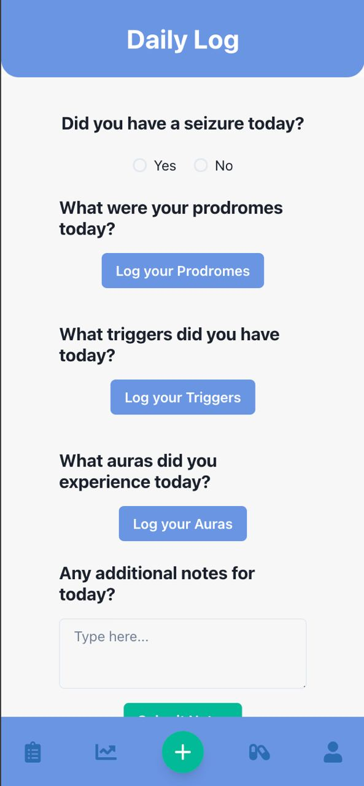<p align="center"></p></td>
    <td>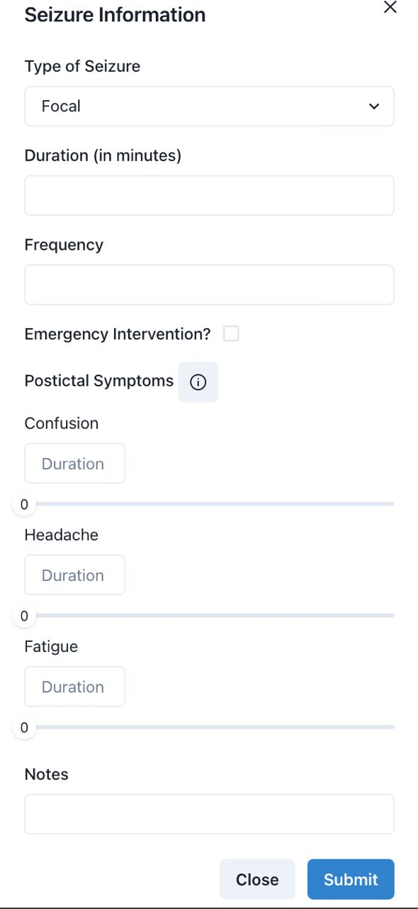<p align="center"></p></td>
    <td>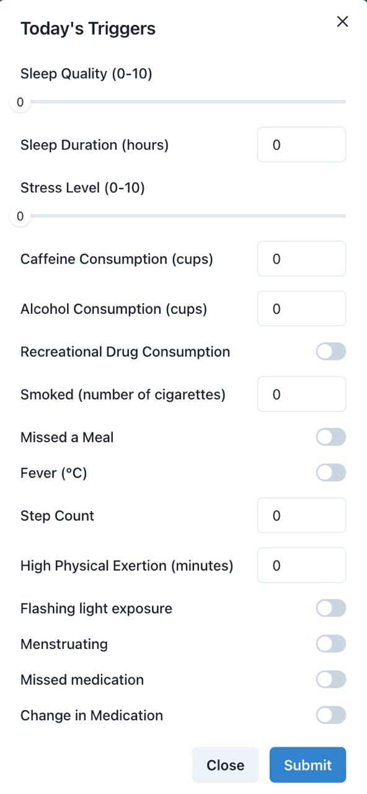<p align="center"></p></td>
  </tr>
  <tr>
    <td>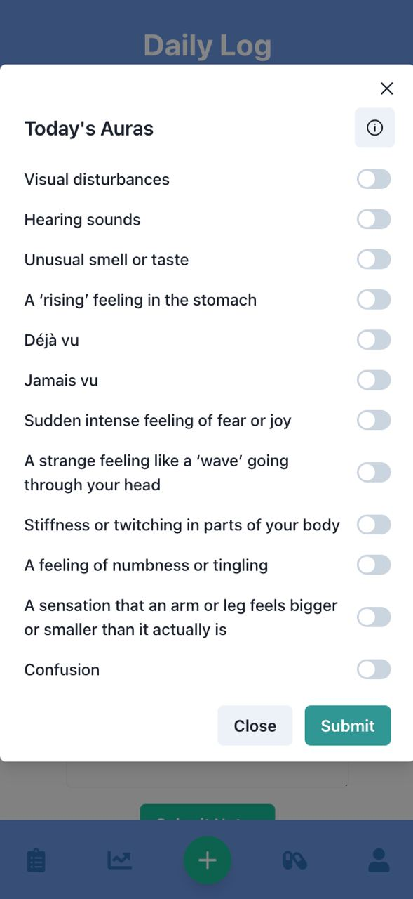<p align="center"></p></td>
    <td>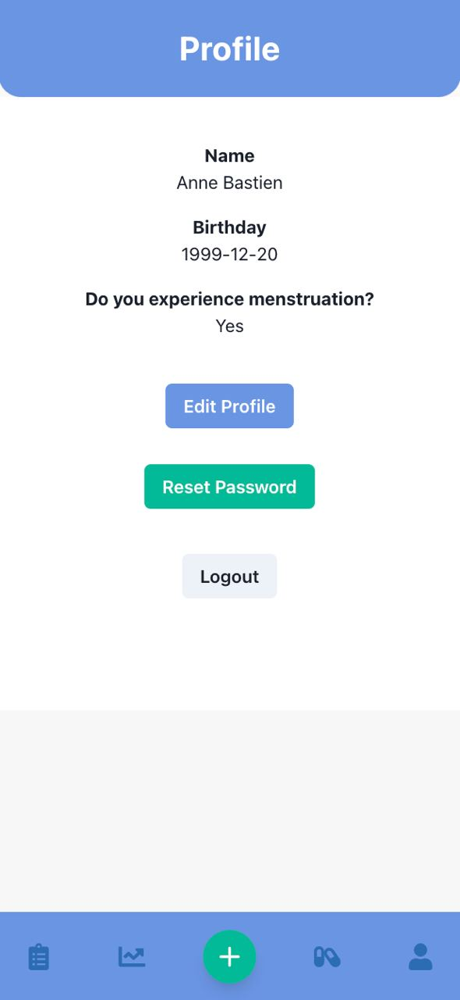<p align="center"></p></td>
    <td>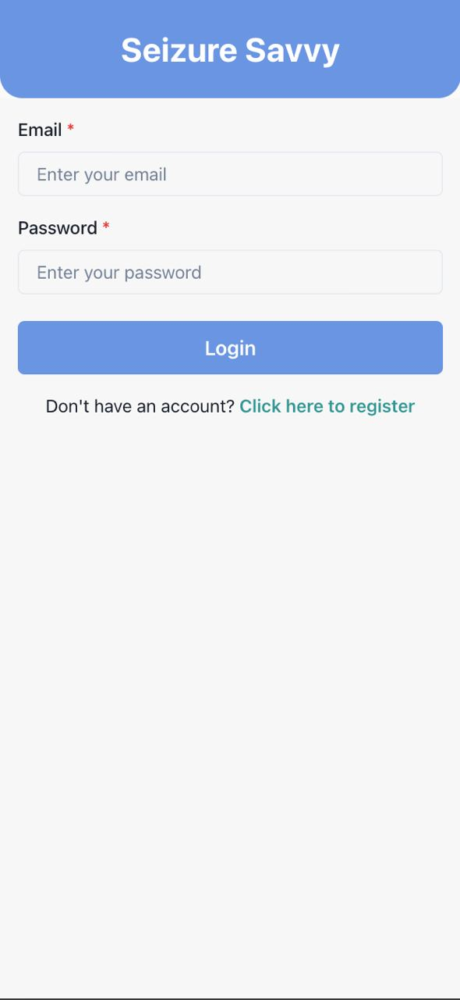<p align="center"></p></td>
    <td>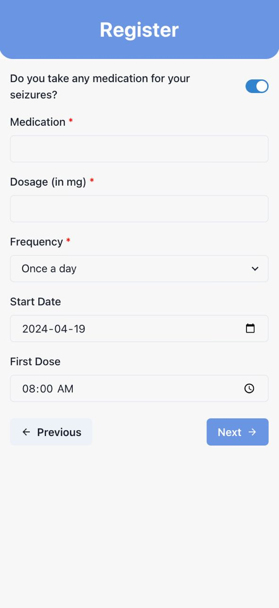<p align="center"></p></td>
  </tr>
</table>

### Machine Learning

Our application utilizes advanced machine learning models to enhance prediction accuracy and understand feature importance:

#### Seizure Prediction Model
For predicting the probability of seizure occurrences, we use an **LSTM (Long Short-Term Memory) network**. This model is ideal for dealing with sequences of data and can remember information for long periods, which is crucial for our needs. It not only considers the immediate data (e.g., today's symptoms) but also the overall pattern over recent days. This approach helps in capturing the complexities of seizure occurrences more accurately. We trained the LSTM on a synthetically generated dataset designed to mirror real-life symptom patterns by defining and sampling from probability distributions for each feature.

#### Feature Importance Analysis
To understand which symptoms (features) significantly impact seizure prediction, we employ the **XGBoost model**, an ensemble of decision trees. XGBoost provides built-in methods to calculate feature importance scores, which are invaluable for our analysis. These scores are determined based on the frequency of a feature's use in the trees and its effectiveness in reducing prediction error, thus highlighting critical predictors in seizure episodes.


### Built With
-  [React](https://reactjs.org/) - Provides the dynamic user interface for our app.
-  [Flask](https://palletsprojects.com/p/flask/) - Serves as the backend framework, ensuring lightweight and efficient server-side logic.
-  [TensorFlow](https://www.tensorflow.org/) - Powers our machine learning models for effective seizure prediction.
-  [scikit-learn](https://scikit-learn.org/stable/) - Utilized for developing various machine learning algorithms critical to our application.
-  [XGBoost](https://en.wikipedia.org/wiki/XGBoost) - Employed for a machine learning models for predicting the symptoms correlate with episodes.
-  [SQLAlchemy](https://www.sqlalchemy.org/) - Manages database operations, providing robust ORM support for our application.
-  [Chakra-UI](https://chakra-ui.com/) - A React component library used to create a seamless and user-friendly interface.


<!-- Installation -->
## Installation

This guide will take you through the steps to get SeizureSavvy up and running on your local machine for development and testing purposes. Follow these detailed instructions to set up both the backend and frontend parts of the application.

### Prerequisites

Before you begin, ensure you have the following installed on your system:
- Python 3.9 or later (3.11 recommended for optimal performance)
- Node.js and npm (npm is typically installed with Node.js)
- Yarn package manager

### Backend Setup

1. **Python Environment Setup**
   - Open your terminal and ensure you are in the root directory of the cloned project.
   - Navigate to the `api` subdirectory:
     ```bash
     cd api
     ```
   - Create a virtual environment to manage your Python dependencies separately from your global Python setup:
     ```bash
     python3.11 -m venv venv  # Use `python3` if `python3.11` is not recognized
     ```
   - Activate the virtual environment:
     - On macOS:
       ```bash
       source venv/bin/activate
       ```
     - On Windows:
       ```bash
       venv\Scripts\activate
       ```

2. **Install Python Dependencies**
   - With the virtual environment activated, install the required Python packages using pip:
     ```bash
     pip install -r requirements.txt  # Use `pip3` if `pip` is not configured for Python 3
     ```
   - If using Anaconda or another Python distribution, ensure no other Python environment is active to avoid conflicts:
     ```bash
     conda deactivate
     ```

3. **Start the Backend Server**
   - With the dependencies installed and the virtual environment active, start the Flask backend server:
     ```bash
     flask run
     ```
   - The server will start and typically listen on `http://localhost:5000`.

### Frontend Setup

1. **Installing Node Dependencies**
   - Ensure that your terminal is in the project's root directory.
   - Install Yarn globally if you haven't already:
     ```bash
     npm install --global yarn
     ```
   - Install the project's Node.js dependencies:
     ```bash
     yarn install
     ```

2. **Building the Frontend**
   - Build the static assets for the frontend application:
     ```bash
     yarn build
     ```

3. **Starting the Frontend Server**
   - With the build complete, you can now start the frontend development server:
     ```bash
     yarn start
     ```
   - This will usually launch the frontend and automatically open a new tab in your default web browser pointing to `http://localhost:3000`.

### Verifying the Installation

After both servers are running, open your web browser and navigate to `http://localhost:3000`. You should see the SeizureSavvy application running. Ensure that the frontend can communicate with the backend by performing actions that require backend interaction.


<!-- Demo -->
## Demo
Watch these demos to get to know the app!

- [Frontend](https://www.loom.com/share/3642c85b243b4fb0a77d047c2686fcea?sid=b935a1fb-d074-45ac-a569-37bdc23a558b)
- [backend](https://www.loom.com/share/2fcca8f1fc34470782ff41d140bfba9e?sid=5d44e3f1-1205-4ca5-aed0-aba911f1c828)
- [ML](https://www.loom.com/share/4ce720c9f4af496e802455ab6f1577c5)

<!-- Team -->
## Our Team

<table align="center">
  <tr>
    <td align="center">
      <a href="https://github.com/MYousry2002">
        <br>
        Mohamed Yousry ElSadec
      </a>
      <p>
      <strong>Main Roles:</strong> Product Manager, Researcher, Backend Developer<br>
      <strong>Key Contributions:</strong> Project coordination, Research initiatives, Database construction, API development
      </p>
    </td>
    <td align="center">
      <a href="https://github.com/chiffonng">
        <br>
        Chiffon Nguyen
      </a>
      <p>
      <strong>Main Roles:</strong> Scrum Developer, Backend Developer, Code Reviewer<br>
      <strong>Key Contributions:</strong> Sprint management, Backend infrastructure, Quality assurance
      </p>
    </td>
    <td align="center">
      <a href="https://github.com/TetianaBas">
        <br>
        Tanya Bas
      </a>
      <p>
      <strong>Main Role:</strong> Data Scientist<br>
      <strong>Key Contributions:</strong> Data analysis, Model development, Insights generation
      </p>
    </td>
    <td align="center">
      <a href="https://github.com/annebstn22">
        <br>
        Anne Bastien
      </a>
      <p>
      <strong>Main Roles:</strong> UI/UX Designer, Frontend Developer<br>
      <strong>Key Contributions:</strong> Interface design, User experience enhancement, Frontend coding
      </p>
    </td>
    <td align="center">
      <a href="https://github.com/MacBeth-M">
        <br>
        Macbeth Matibe
      </a>
      <p>
      <strong>Main Roles:</strong> UI/UX Designer, Frontend Developer<br>
      <strong>Key Contributions:</strong> Visual design, Frontend implementation, User interaction design
      </p>
    </td>
  </tr>
</table>


<!-- Contribution and Issues -->
## Contributions and Issues

### Contributing to SeizureSavvy

We welcome contributions from everyone, whether it's through code improvements, bug fixes, documentation, or feature requests.

### Reporting Issues

We use GitHub Issues to track public bugs and feature requests:

1. **Check Existing Issues**
   - Before submitting a new issue, please check if it has already been reported. Use the search bar to check for similar problems.

2. **Create a New Issue**
   - If your issue is new, click the 'Issues' tab and then 'New Issue' button to submit it.
   - Clearly describe the issue including steps to reproduce when it is a bug.
   - Include screenshots if possible to illustrate the problem.

### Support

If you need assistance with anything related to the project, please contact us through the GitHub Issues section. We are here to help!


We look forward to your contributions and are excited to see what we can build together!


## License

SeizureSavvy is made available under the MIT License. For more details, see the [LICENSE](LICENSE.md) file included with this project.
